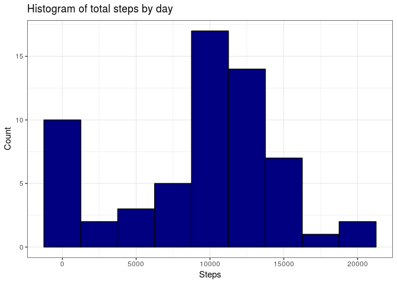
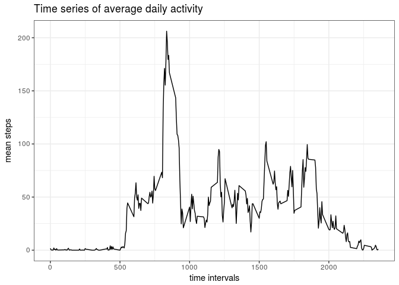
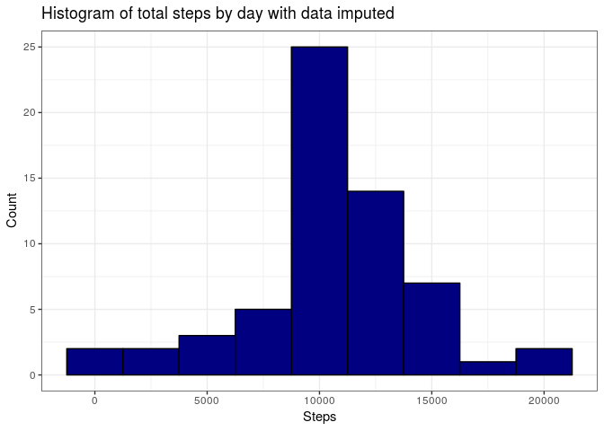
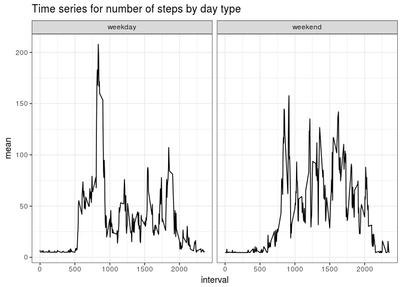

Option to put the warnings off.

```r
knitr::opts_chunk$set(warning=FALSE, message = FALSE)
```

Libraries for the assigment


```r
library(readr)
library(dplyr)
library(ggplot2)
library(lubridate)
```

## Loading and preprocessing the data

The data is

```r
data <- read.csv("activity.csv")
data <- data %>% mutate(date = ymd(date), day = factor(weekdays(date)))
```

## What is mean total number of steps taken per day?


```r
stepsDay <- data %>% group_by(date) %>% summarise(sum = sum(steps, na.rm = TRUE))
knitr::kable(head(stepsDay))
```


|date       |   sum|
|:----------|-----:|
|2012-10-01 |     0|
|2012-10-02 |   126|
|2012-10-03 | 11352|
|2012-10-04 | 12116|
|2012-10-05 | 13294|
|2012-10-06 | 15420|
Histogram of the total number of steps taken each day

```r
ggplot(stepsDay, aes(x = sum)) +
        geom_histogram(binwidth = 2500, fill = "navyblue", col = "black") +
        labs(title = "Histogram of total steps by day", x = "Steps", y = "Count") +
        theme_bw()
```

<!-- -->

```r
ggsave("plot1.png", device = "png", dpi = 600, height = 4, width = 4)
```

mean value


```r
mean(stepsDay$sum, na.rm = TRUE)
```

```
## [1] 9354.23
```
Median


```r
median(stepsDay$sum, na.rm = TRUE)
```

```
## [1] 10395
```


## What is the average daily activity pattern?


```r
averageDaily <- data %>% group_by(interval) %>% 
        summarise(mean = mean(steps, na.rm = TRUE))
```

Time series of the average steps daIly pattern.


```r
ggplot(averageDaily, aes(x = interval, y = mean)) +
        geom_line() +
        ggtitle("Time series of average daily activity") +
        labs(x = "time intervals", y = "mean steps") +
        theme_bw()
```

<!-- -->

```r
ggsave("plot2.png", device = "png", dpi = 600, height = 4, width = 4)
```


```r
averageDaily[which.max(averageDaily$mean),] 
```

```
## # A tibble: 1 x 2
##   interval  mean
##      <int> <dbl>
## 1      835  206.
```
835 time interval have the maximun mean steps value with 206.1 steps.

## Imputing missing values

The total number of missing value in the dataset is 


```r
missingValues <- data %>% filter(is.na(steps)) %>% 
        summarise(missings = n())
missingValues
```

```
##   missings
## 1     2304
```
the dataset contains 2304 missings values.

We going to use the mean value for filling missing values in the dataset.


```r
missingPosition <- is.na(data[, 1])
mean <- mean(data$steps, na.rm = TRUE)
```
The mean value is 37.3825996. The original dataset with impute data.


```r
data1 <- data
data1[missingPosition, 1] <- mean
knitr::kable(head(data1))
```


|   steps|date       | interval|day    |
|-------:|:----------|--------:|:------|
| 37.3826|2012-10-01 |        0|Monday |
| 37.3826|2012-10-01 |        5|Monday |
| 37.3826|2012-10-01 |       10|Monday |
| 37.3826|2012-10-01 |       15|Monday |
| 37.3826|2012-10-01 |       20|Monday |
| 37.3826|2012-10-01 |       25|Monday |


```r
stepsDay1 <- data1 %>% group_by(date) %>% summarise(sum = sum(steps, na.rm = TRUE))
ggplot(stepsDay1, aes(x = sum)) +
        geom_histogram(binwidth = 2500, fill = "navyblue", col = "black") +
        labs(title = "Histogram of total steps by day with data imputed", x = "Steps", y = "Count") +
        theme_bw()
```

<!-- -->

```r
ggsave("plot3.png", device = "png", dpi = 600, height = 4, width = 4)
```


## Are there differences in activity patterns between weekdays and weekends?


```r
weekday <- unique(data$day)[1:5]
data1 <- data1 %>% mutate(dayCategory = if_else(day %in% weekday, "weekday", "weekend"))

weekTypeAverage <- data1 %>% group_by(interval, dayCategory) %>% 
        summarise(mean = mean(steps, na.rm = TRUE)) %>% mutate(dayCategory = factor(dayCategory))

ggplot(weekTypeAverage, aes(interval, mean)) +
        geom_line() +
        facet_wrap(~dayCategory, scales = "fixed") +
        ggtitle("Time series for number of steps by day type") +
        theme_bw()
```

<!-- -->

```r
ggsave("plot4.png", device = "png", dpi = 600, height = 4, width = 4)
```

